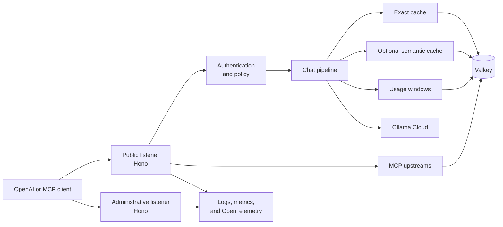
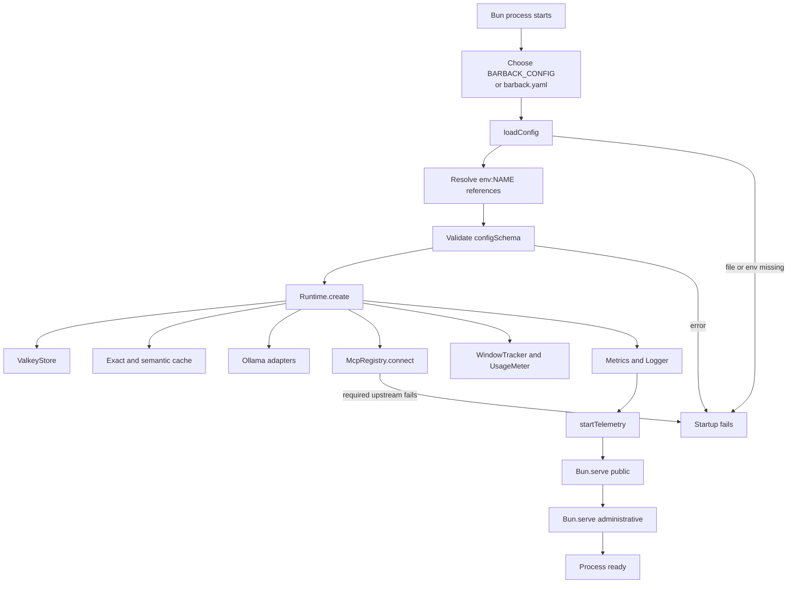
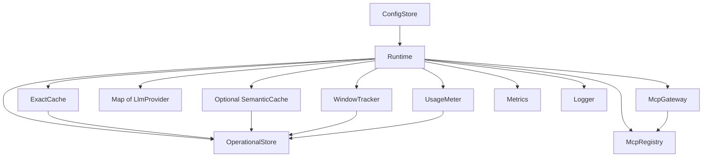
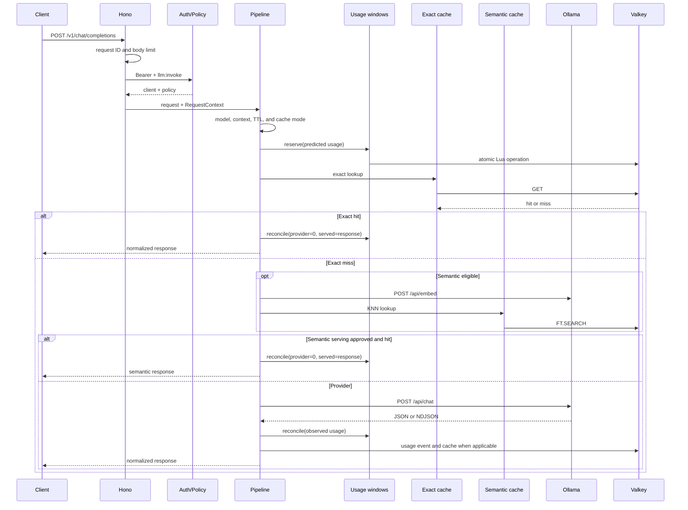
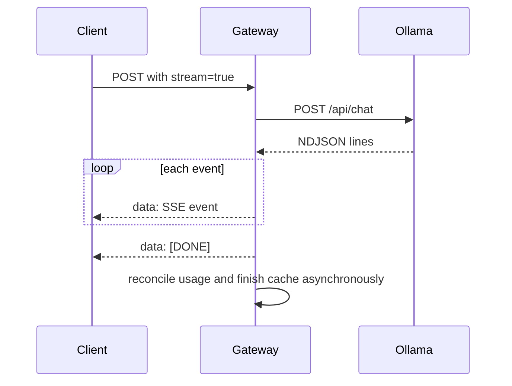
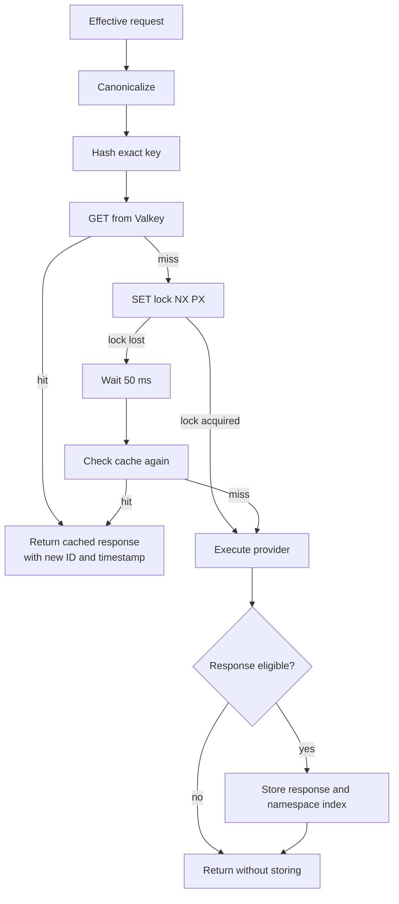
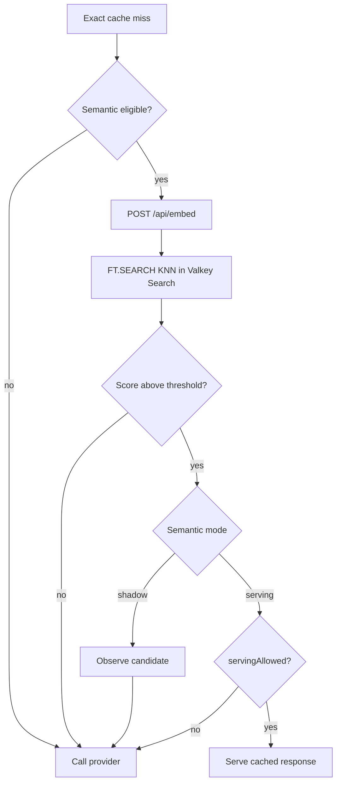
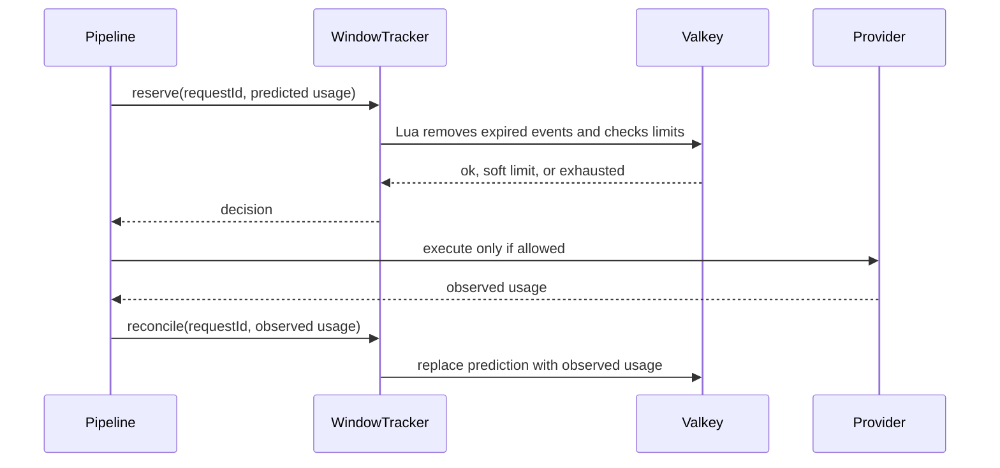
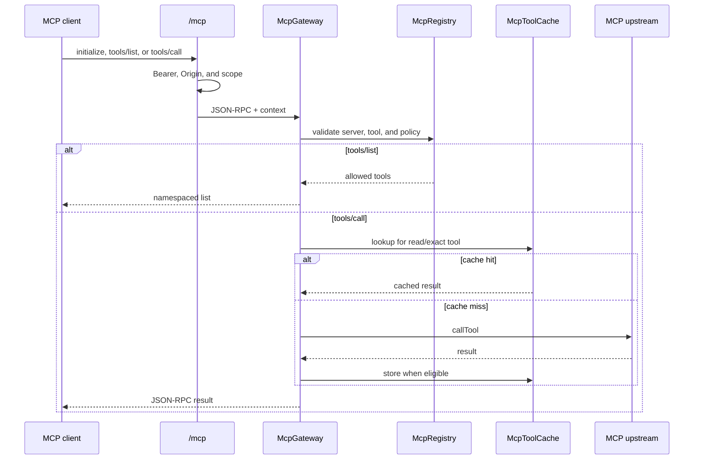
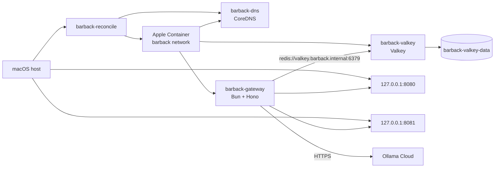

# Barback: Technical and Operations Guide

This document explains how Barback starts, processes requests, applies policy, uses Valkey, and runs on Apple Container.

The source code is the final authority for behavior. The main entry points are:

- [`src/index.ts`](../src/index.ts): process lifecycle and HTTP listeners.
- [`src/api/app.ts`](../src/api/app.ts): public and administrative routes.
- [`src/core/runtime.ts`](../src/core/runtime.ts): runtime resource composition.
- [`src/core/pipeline.ts`](../src/core/pipeline.ts): chat request pipeline.
- [`src/config/schema.ts`](../src/config/schema.ts): configuration contract.

## 1. Overview

Barback is a local gateway for LLM and MCP traffic. It sits between clients and upstream services and applies controls before execution:

- Bearer-key authentication;
- client scopes and policies;
- allowed model aliases;
- context limits;
- usage windows;
- exact and semantic caching;
- provider retries and circuit breakers;
- MCP tool authorization;
- structured logs, metrics, and health checks.

The process has two listeners:

| Listener | Default | Purpose |
| --- | --- | --- |
| Public | `127.0.0.1:8080` | OpenAI-compatible chat, models, MCP, and health checks |
| Administrative | `127.0.0.1:8081` | Metrics and authenticated administrative operations |

The overall topology is:



A request is not sent to a provider until it passes authentication, payload validation, model authorization, context evaluation, and usage reservation when usage windows are configured.

## 2. Components

| Component | Implementation | Responsibility |
| --- | --- | --- |
| Configuration | `src/config/loader.ts`, `src/config/schema.ts` | Reads YAML, resolves `env:NAME`, and validates the result |
| Runtime | `src/core/runtime.ts` | Builds and owns the store, caches, providers, MCP, usage, and telemetry |
| API | `src/api/app.ts` | Exposes public and administrative endpoints |
| Pipeline | `src/core/pipeline.ts` | Coordinates controls, cache, provider, and reconciliation |
| Store | `src/storage/valkey.ts` | Abstracts Valkey commands and provides `MemoryStore` for tests |
| Exact cache | `src/cache/exact-cache.ts` | Deterministic cache keyed by a canonical request |
| Semantic cache | `src/cache/semantic-cache.ts` | Approximate embedding search through Valkey Search |
| Usage | `src/usage/window-tracker.ts`, `src/usage/meter.ts` | Reserves, reconciles, and records consumption |
| Provider | `src/providers/ollama-cloud/adapter.ts` | Maps the internal contract to Ollama Cloud |
| MCP | `src/mcp/registry.ts`, `src/mcp/gateway.ts` | Connects upstreams, authorizes tools, and forwards calls |
| Limits | `src/limits/circuit-breaker.ts`, `src/usage/context-window.ts` | Protects the provider and context window |
| Telemetry | `src/telemetry/*.ts` | Logs, Prometheus metrics, and OpenTelemetry initialization |

## 3. Startup

### 3.1 Startup sequence

The default command is `bun run start`, which executes `src/index.ts`.



### 3.2 Configuration

The default file is `barback.yaml`. The starter file is [`config/barback.example.yaml`](../config/barback.example.yaml).

Any scalar string can reference an environment variable:

```yaml
providers:
  ollama-cloud:
    apiKey: env:OLLAMA_API_KEY
```

Missing or empty variables make startup fail. Credentials should remain outside versioned YAML.

The example uses these main variables:

| Variable | Usage |
| --- | --- |
| `BARBACK_SERVER_HOST` | Public listener host |
| `BARBACK_ADMIN_HOST` | Administrative listener host |
| `BARBACK_CLIENT_KEY` | Default client key |
| `BARBACK_ADMIN_KEY` | Administrative key |
| `OLLAMA_API_KEY` | Ollama Cloud credential |
| `OLLAMA_CODE_MODEL` | Upstream model for the `code-default` alias |
| `OLLAMA_EMBEDDING_MODEL` | Upstream model for the `cache-embedding` alias |
| `VALKEY_URL` | Valkey connection URL |

The [`.env.example`](../.env.example) file contains local starter values. Copy it to `.env` and replace the provider placeholders before running the gateway.

### 3.3 Startup failure behavior

The store is connected during `Runtime.create()`. If the Valkey connection fails, the runtime logs a warning and continues starting. The process can therefore listen on HTTP while `/health/ready` returns `503` because the store is unavailable.

Semantic cache initialization is also tolerant when its mode is `shadow`. This lets the gateway start without Valkey Search, although the semantic feature will not work. In `serving` mode, initialization failures are fatal.

A required MCP upstream can prevent startup. Optional upstreams may remain in `failed` state without preventing the process from starting.

### 3.4 Reload and shutdown

The process handles:

- `SIGHUP`: loads the YAML and builds a replacement runtime before swapping active references.
- `SIGINT` and `SIGTERM`: stop both listeners and close MCP, Valkey, and telemetry resources.

If the replacement configuration is invalid, the active configuration remains unchanged. Reload does not recreate HTTP listeners; changes to listener hosts, ports, or the metrics path require a process restart.

## 4. Runtime

The runtime owns the resources shared by requests:



Production uses `ValkeyStore`. Unit tests can inject `MemoryStore`, but that store does not implement Lua scripts or arbitrary commands and cannot replace Valkey for semantic cache or real usage windows.

## 5. Chat Requests

The endpoint is `POST /v1/chat/completions`.

### 5.1 Processing order

1. Middleware creates or validates `x-request-id`.
2. The `/v1/*` body limit is applied.
3. `Authorization: Bearer <key>` identifies the client.
4. The `llm:invoke` scope is required.
5. The client's policy is placed in `RequestContext`.
6. The payload is validated with Zod.
7. The model alias is resolved and its `chat` capability is checked.
8. The policy confirms that the model is allowed.
9. Estimated context and output usage are calculated.
10. Cache mode and namespace are determined.
11. A usage window is reserved when configured.
12. Exact cache is checked.
13. Semantic cache may be checked when the policy and request allow it.
14. If no cache response is served, the Ollama provider is called.
15. The result is normalized to the OpenAI-compatible contract.
16. Predicted usage is reconciled with observed usage.
17. Metrics, usage events, and response headers are updated.
18. The response may be persisted in eligible caches.



### 5.2 Request IDs and headers

A supplied `x-request-id` is accepted only when it is 1 to 128 characters long and contains letters, numbers, `_`, `.`, `:` or `-`. Otherwise, a UUID is generated.

Responses can include:

- `x-barback-request-id`;
- `x-barback-cache-status`;
- `x-barback-cache-type`;
- `x-barback-cache-id`;
- `x-barback-context-utilization`;
- `x-barback-window-status`.

### 5.3 Streaming

When `stream: true`, the adapter reads Ollama NDJSON and the pipeline emits Server-Sent Events. Final usage is taken from the event containing `finishReason` and `usage`. The stream ends with `data: [DONE]`.



## 6. Authentication and Policies

Credentials are compared case-sensitively using a timing-safe comparison. The expected format is exactly:

```text
Authorization: Bearer <key>
```

Available scopes:

| Scope | Permission |
| --- | --- |
| `llm:invoke` | Execute chat completions |
| `llm:models` | List allowed models |
| `mcp:list` | Initialize MCP and list tools |
| `mcp:call` | Execute MCP tools |
| `admin` | Access the administrative listener |

A policy controls:

- allowed chat model aliases;
- maximum output;
- maximum cache mode;
- authorized MCP toolsets.

Policies are evaluated for every request. A valid reload changes behavior without restarting the process.

The administrative listener requires authentication and `admin` for every route. A regular client key cannot access `/metrics` or `/admin/*`.

## 7. Exact Cache

Exact cache uses a deterministic representation of the request. Canonicalization:

- normalizes CRLF and CR to LF;
- normalizes strings to NFC;
- sorts object keys;
- preserves array order;
- produces stable JSON.

The cache ID includes canonicalization version, client, namespace, provider, model alias, and the effective request.

A response is cacheable only when it has no tool calls, finishes with `stop` or `length`, and fits within `cache.maxResponseBytes`.



Main keys are:

```text
<prefix>:cache:exact:<id>
<prefix>:cache:index:namespace:<namespace>
<prefix>:lock:<id>
```

The lock is released with a Lua script and cache writes are best effort. A cache failure should not turn an otherwise executable provider request into an error.

Cache headers can choose a namespace, TTL, bypass, or refresh. The policy remains the upper bound: a client may narrow behavior but cannot expand what the policy allows.

## 8. Semantic Cache

Semantic cache requires Valkey Search. It stores embeddings and uses HNSW KNN search with COSINE distance.

A request is semantically eligible only when:

- it has no tools;
- all messages use `system` or `user` roles;
- every message content is a string;
- the number of messages does not exceed `maxMessages`.

The embedding projection separates messages by role. The partition also includes hashes of the client, namespace, provider, model alias, and relevant parameters so incompatible requests do not share results.

There are two modes:

| Mode | Behavior |
| --- | --- |
| `shadow` | Records or evaluates the candidate but still calls the provider |
| `serving` | May serve a candidate when all approval criteria pass |



The example keeps semantic serving disabled with `servingApproved: false` and gives the default policy exact cache. The `valkey/valkey:8-alpine` image does not include Valkey Search. For a basic installation with that image:

```yaml
storage:
  valkey:
    vectorSearch: false

cache:
  semantic:
    enabled: false
```

When semantic cache is enabled, the provider must expose an embedding model and Valkey must support `FT.CREATE`, `FT.SEARCH`, and related index commands.

## 9. Context and Usage Windows

### 9.1 Context limits

The current tokenizer is approximate. It estimates tokens from message size, tools, and per-message overhead. Reserved output is limited by the lowest value among the request, policy, and model.

States are:

| State | Default condition |
| --- | --- |
| `ok` | Below `warningThreshold` |
| `warning` | Above `0.70` |
| `compact` | Above `0.85` |
| rejected | Greater than or equal to `0.95` |

The `compact` state is informational. The current implementation does not compact message history automatically.

### 9.2 Usage windows

A window can be rolling or UTC calendar-based and can be scoped by client, provider, and model. Limits can count:

- requests;
- input tokens;
- output tokens;
- total tokens;
- equivalent cost in micros.

Reservation is atomic in Valkey using sorted sets, idempotency hashes, and a Lua script. This prevents concurrent requests from exceeding a hard limit through a race.



The example has `usageWindows: []`, so no usage enforcement is active until windows are configured.

`UsageMeter` also records events for aggregation and administrative inspection. Reservation occurs before cache and provider work. An exact cache hit reconciles provider usage as zero and served usage with the cached response.

## 10. Ollama Cloud Provider

Each configured provider creates an `OllamaCloudAdapter`.

| Operation | Endpoint |
| --- | --- |
| Readiness | `GET /api/tags` |
| Chat | `POST /api/chat` |
| Embeddings | `POST /api/embed` |

The adapter:

- sends the configured Bearer token;
- applies a timeout per attempt;
- retries eligible 429, 5xx, and network errors;
- uses exponential backoff with jitter;
- accepts JSON for normal chat and NDJSON for streaming;
- normalizes Ollama usage fields.

The circuit breaker is process-local. After enough failures, new provider calls are blocked until the open period expires. A successful HTTP response closes the circuit and clears the local failure count.

The public model alias is `code-default`; its upstream name comes from `OLLAMA_CODE_MODEL`:

```yaml
models:
  code-default:
    provider: ollama-cloud
    upstreamModel: env:OLLAMA_CODE_MODEL
```

Clients send the alias and do not need to know the upstream model name.

## 11. MCP

MCP has two phases: upstream registration during startup and authorization/forwarding for each request.

During startup, `McpRegistry`:

1. connects to `stdio`, Streamable HTTP, or SSE servers;
2. calls `tools/list`;
3. namespaces tools as `server.tool`;
4. marks each server connected or failed;
5. prevents startup when a required server fails.

To execute a tool, two authorization checks must agree:

- the upstream server tool allowlist;
- the toolset allowed by the client's policy.

The default behavior is deny-by-default.



The configured endpoint is `/mcp`. The primary and compatibility protocol versions come from configuration. Tool-call caching is restricted to read operations using exact mode.

## 12. Health and Administration

### 12.1 Health endpoints

| Endpoint | Check |
| --- | --- |
| `GET /health/live` | The HTTP process is alive; returns `200` while it responds |
| `GET /health/ready` | Valkey, required MCP servers, and all providers |
| `GET /health` | Valkey and MCP state |

`/health/ready` may return `503` while `/health/live` returns `200`. This is expected when a dependency is unavailable.

### 12.2 Public routes

| Route | Scope |
| --- | --- |
| `GET /v1/models` | `llm:models` |
| `POST /v1/chat/completions` | `llm:invoke` |
| `POST /mcp` | `mcp:list` or `mcp:call` |
| `GET /health`, `/health/live`, `/health/ready` | None |

### 12.3 Administrative routes

Every administrative route requires `admin`:

| Route | Purpose |
| --- | --- |
| `GET /metrics` | Prometheus metrics |
| `GET /admin/usage/windows` | Inspect usage windows |
| `GET /admin/cache/stats` | Inspect cache state |
| `DELETE /admin/cache/entries/:id` | Invalidate by exact cache ID |
| `DELETE /admin/cache/namespaces/:namespace` | Invalidate an exact namespace |
| `POST /admin/config/reload` | Reload YAML configuration |

Example:

```sh
curl -H "Authorization: Bearer $BARBACK_ADMIN_KEY" \
  http://127.0.0.1:8081/metrics
```

### 12.4 Telemetry

Logs are structured JSON. The logger redacts fields whose names contain authorization, token, secret, password, cookie, or API key. The default example does not capture prompt content or request headers.

Prometheus is exposed on the administrative listener. OpenTelemetry initializes the SDK and OTLP exporter when enabled, but the current code does not explicitly create business spans.

## 13. Apple Container

### 13.1 Gateway image

The [`Dockerfile`](../Dockerfile) uses `oven/bun:1.4.0-alpine`, installs production dependencies, copies `src/`, runs as user `bun`, and exposes ports 8080 and 8081.

The YAML is not copied into the image. It is mounted read-only at `/app/barback.yaml`.

### 13.2 Shared network

The managed stack uses the `barback` NAT network and a dedicated CoreDNS resolver to discover services by their FQDNs.

1. `barback-dns` resolves `barback.internal` requests.
2. The gateway is configured with canonical URLs like `VALKEY_URL=redis://valkey.barback.internal:6379`.
3. The reconciler updates the DNS records when containers start or change IP addresses.



Valkey and the DNS server are not published to the host. Only the gateway HTTP ports are published.

### 13.3 Prerequisites

1. Install Apple Container from the signed release package for the target macOS version.
2. Start the service:

```sh
container system start
```

3. On Apple Silicon without Rosetta, configure the builder to use native ARM64:

```toml
[build]
rosetta = false
```

Put this block in `~/.config/container/config.toml`, then restart the service:

```sh
container system stop
container system start
```

### 13.4 Installation and startup

From the project directory:

```sh
bun install --frozen-lockfile
cp config/barback.example.yaml barback.yaml
cp .env.example .env
```

Edit `.env` and provide a valid Ollama key and model names. For the base Valkey image, disable semantic cache as described in [Semantic Cache](#8-semantic-cache).

Start the stack:

```sh
bun run reconcile up
```

The reconciler creates the network, builds the gateway image, starts Valkey and the DNS server, and then starts the gateway container with its required mounts and environment variables.

Check containers:

```sh
container list --all
```

Check internal communication:

```sh
container exec barback-gateway \
  bun -e 'import Redis from "ioredis"; const r = new Redis("redis://valkey.barback.internal:6379"); console.log(await r.ping()); await r.quit();'
```

The expected output is `PONG`.

Check readiness from inside the gateway:

```sh
container exec barback-gateway \
  bun -e 'const r = await fetch("http://127.0.0.1:8080/health/ready"); console.log(r.status, await r.text());'
```

The expected status is `200` when Valkey, required MCP servers, and Ollama are available.

### 13.5 Shutdown

```sh
container stop barback-gateway barback-valkey
```

To remove the containers without deleting the data volume:

```sh
container delete barback-gateway barback-valkey
```

Delete `barback-valkey-data` explicitly only when the persisted data should also be removed.

### 13.6 Published ports and Local Network

If Valkey responds inside its container but a host connection to a published port returns `ECONNRESET`, the problem is Apple Container host networking on macOS, not the Redis protocol.

Enable Local Network access for `container-runtime-linux` under **System Settings > Privacy & Security > Local Network**. On versions where the runtime is not listed, the documented workaround is:

```sh
sudo defaults write com.apple.network.local-network AllowedEthernetLocalNetworkAddresses -array "192.168.64.0/24"
sudo defaults write com.apple.network.local-network AllowedWiFiLocalNetworkAddresses -array "192.168.64.0/24"
```

Reboot macOS after changing these settings. Gateway-Valkey communication on the internal network does not depend on the Valkey host port mapping.

## 14. Tests

The scripts in [`package.json`](../package.json) are:

```sh
bun run typecheck
bun run lint
bun test
bun run test:unit
bun run test:contract
bun run test:integration
bun run check
```

The Valkey integration test is enabled when `VALKEY_URL` is set. On the host, it depends on access to the published port. In an Apple Container environment with Local Network blocked, a host integration test may fail even while gateway-Valkey communication inside the network works.

For a container installation, use the internal gateway test and readiness check described above.

Current test coverage includes:

- authentication and scopes;
- OpenAI-compatible contracts;
- MCP contracts;
- canonicalization and exact cache;
- configuration schema and loading;
- log redaction;
- canonicalization properties;
- real Valkey reservation and invalidation.

The following areas do not yet have broad direct coverage: semantic cache evaluation, circuit breaker behavior, reload, readiness, complete metrics, real MCP calls, and Apple Container lifecycle.

## 15. Current Limitations

These limitations reflect the current implementation and should be considered before deployment outside a local environment:

- Empty `usageWindows` means no consumption limit is enforced.
- The context tokenizer is approximate and model-independent.
- `compact` reports pressure but does not compact history automatically.
- Semantic serving requires approval, metrics, and Valkey Search; the example does not enable it for serving.
- Shadow semantic counters and evaluation are not a complete quality gate yet.
- The circuit breaker is process-local and does not share state across replicas.
- Exact-cache locks are short; very long provider calls can be duplicated after lock expiry.
- MCP calls do not use usage windows.
- Reload swaps runtime resources but does not recreate HTTP listeners.
- The Dockerfile does not include external executables required by `stdio` MCP upstreams.
- Valkey's internal IP can change after recreation; the reconciler automatically updates the DNS records without recreating the gateway.
- Host access to published ports depends on macOS Local Network permissions.

## 16. Example Request

With the gateway running and a policy that authorizes `code-default`:

```sh
curl http://127.0.0.1:8080/v1/chat/completions \
  -H "Authorization: Bearer $BARBACK_CLIENT_KEY" \
  -H "Content-Type: application/json" \
  -d '{
    "model": "code-default",
    "messages": [
      {"role": "user", "content": "Respond with only: OK"}
    ]
  }'
```

Barback maps `code-default` to `OLLAMA_CODE_MODEL`, applies the policy, and sends the request to Ollama Cloud. The response uses the OpenAI-compatible format and may include request ID, cache, and context headers.
