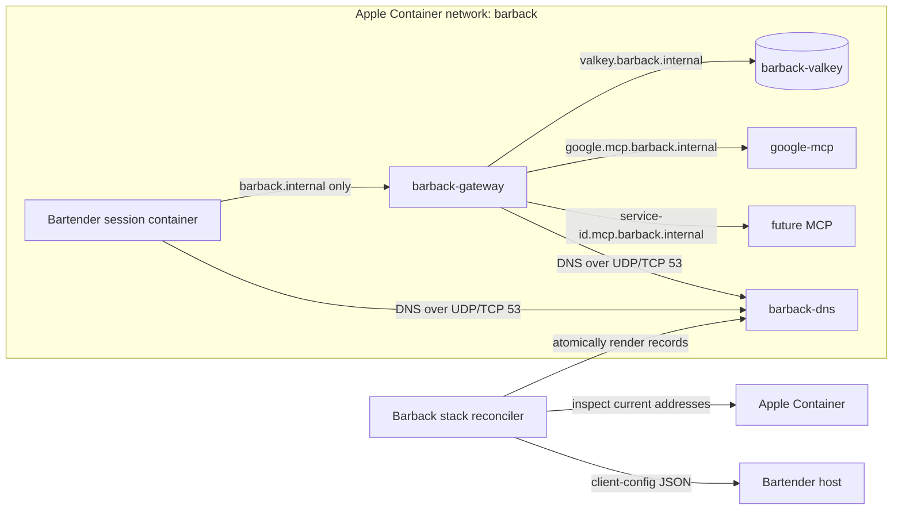

# DNS and Service Discovery Specification

Status: Proposed

Target runtime: Apple Container 1.3.0 or newer

## 1. Purpose

Barback owns DNS configuration and service discovery for its Apple Container deployment. This includes Barback itself, Valkey, Google MCP, and future MCP upstreams registered with Barback.

Bartender also runs in Apple Container. It must use Barback as its only configured model and MCP gateway and must address Barback by DNS name. Bartender must never be configured with a Valkey address or a direct MCP upstream address.

The words MUST, MUST NOT, SHOULD, SHOULD NOT, and MAY in this document are normative.

## 2. Current Problem

The current startup scripts inspect each dependency and inject its container IP into Barback:

- `VALKEY_URL=redis://<ip>:6379`;
- `GOOGLE_MCP_URL=http://<ip>:8090/mcp`.

Apple Container assigns a new address when a container is recreated. The current design therefore requires Barback to be recreated after an upstream address changes and requires every new MCP to add more IP-discovery logic to `start-barback.sh`.

Apple Container 1.3.0 accepts `--dns`, `--dns-domain`, and `--dns-search` when creating a container, but it does not provide the Barback-owned custom-network naming contract required here and `container run` does not expose a static-IP option. Any embedded discovery available on the configured `default` network is not a substitute for this private zone and registry. The design must account for both facts:

- application configuration can and must use stable DNS names;
- the DNS resolver address itself must be bootstrapped from one inspected IP.

IP discovery is permitted only in the Barback-owned DNS control plane and in Apple network-gateway plumbing needed to reach a host-native credential proxy. IP literals are forbidden in application endpoint configuration.

## 3. Goals

1. Give Barback, Valkey, and every MCP service a stable, explicit FQDN.
2. Make upstream container replacement transparent to Barback after DNS convergence.
3. Give Bartender one stable Barback FQDN for model and MCP traffic.
4. Make adding an MCP a declarative registry change rather than new shell logic.
5. Keep Valkey, MCP, and DNS ports unpublished from the macOS host.
6. Fail closed when DNS configuration is missing, stale, or inconsistent.
7. Preserve Bearer authentication and Barback policy enforcement at the gateway.

## 4. Non-goals

- General-purpose service discovery for containers unrelated to Barback.
- Replacing Barback authentication with network location or DNS.
- Exposing Valkey or MCP upstreams to Bartender.
- Managing Google OAuth credentials or MCP-specific credentials in DNS configuration.
- High availability for a single-machine development deployment.
- SRV-based port discovery in the first version.
- DNS records for `stdio` MCP subprocesses. Only network MCP services participate in this registry.
- Network-level egress isolation for all Bartender traffic. This specification requires exclusive model and MCP routing through Barback; broader browser or tool egress policy remains a Bartender concern.

## 5. Ownership

The Barback repository MUST own:

- creation and validation of the Apple Container network used by the stack;
- lifecycle and configuration of the DNS resolver;
- the service registry and DNS record renderer;
- discovery of current container addresses through `container inspect`;
- reconciliation when service addresses or lifecycle state change;
- DNS configuration passed to Barback, Valkey, and managed MCP containers;
- the machine-readable client configuration consumed by Bartender;
- readiness diagnostics for DNS and registered dependencies.

An MCP repository owns its image, process configuration, health endpoint, and credentials. It MUST NOT own the shared network or create DNS records independently.

Bartender owns consumption of Barback's client configuration and injection of that configuration into its session containers. It MUST NOT infer container IPs or inspect Valkey and MCP containers.

## 6. Logical Architecture



The initial implementation SHOULD use a dedicated container named `barback-dns` with a Barback-built resolver image. The image MUST contain a CoreDNS base pinned by digest and a Barback-owned lease supervisor or plugin. Stock CoreDNS alone does not satisfy the lease behavior in this specification.

The resolver MUST be the only component whose current IP is injected into container runtime arguments. It MUST NOT appear in a model, Valkey, MCP, or Bartender URL.

### 6.1 Network Topology

The `barback` network MUST use NAT mode and MUST NOT be created with `container network create --internal`. Barback, Google MCP, future internet-backed MCPs, and the DNS forwarder require controlled outbound DNS and HTTPS access.

The network name from Barback client configuration is authoritative for Bartender sessions. The Bartender Apple Container driver MUST inspect and join this existing network, but MUST NOT create it, mutate it, or apply its current internal-network validation to this topology. `NANOCLAW_EGRESS_NETWORK` and Barback client configuration MUST NOT silently select different networks.

All services initially share one Apple Container network because Apple Container 1.3.0 exposes one network attachment at container creation. DNS naming is not a network access control. Bartender's exclusivity requirement is enforced by realized provider/MCP configuration, Barback authentication, and tests that reject direct remote MCP endpoints.

For a host-native OneCLI proxy, Barback client configuration MUST also carry the inspected network gateway address. The Bartender driver MUST preserve its `host.docker.internal` and `gateway.docker.internal` host mapping using that value, without reclassifying the NAT network as internal. This gateway address is runtime plumbing and MUST never replace `barback.internal` in an application URL.

## 7. Naming Contract

The authoritative private zone is `barback.internal.`. `.local` MUST NOT be used because it is reserved for multicast DNS behavior.

| Role | Canonical FQDN | Default port | Consumers |
| --- | --- | --- | --- |
| Barback public API and MCP gateway | `barback.internal` | `8080` | Bartender and approved network clients |
| Barback admin API | `barback.internal` | `8081` | authenticated operators only |
| Valkey | `valkey.barback.internal` | `6379` | Barback only |
| Google MCP | `google.mcp.barback.internal` | `8090` | Barback only |
| Future MCP | `<service-id>.mcp.barback.internal` | registry-defined | Barback only |
| DNS resolver | `dns.barback.internal` | `53/udp`, `53/tcp` | diagnostic use; bootstrap remains by IP |

Rules:

- Names MUST be lowercase ASCII.
- `<service-id>` MUST match `^[a-z0-9](?:[a-z0-9-]{0,61}[a-z0-9])?$`.
- FQDNs MUST be passed with their full zone in application configuration. Search domains are convenience only.
- Records MUST be explicit. Wildcard records are forbidden.
- The first version MUST publish IPv4 `A` records. It MAY add `AAAA` records only after all consumers and health probes are tested with IPv6.
- Record TTL MUST default to 5 seconds and MUST NOT exceed 30 seconds.
- Unknown names inside `barback.internal.` MUST return `NXDOMAIN` and MUST NOT be forwarded to public resolvers.
- DNS does not carry ports. URLs MUST continue to include the configured service port.

Canonical application endpoints are:

```text
redis://valkey.barback.internal:6379
http://google.mcp.barback.internal:8090/mcp
http://barback.internal:8080/v1
http://barback.internal:8080/mcp
```

## 8. Declarative Service Registry

The stack MUST have one orchestration manifest separate from `barback.yaml`. The committed example SHOULD be `config/stack.example.yaml`; the local file SHOULD be `barback-stack.yaml` and MUST contain no credentials.

The registry describes runtime discovery. `barback.yaml` remains the source of truth for model policy, MCP authorization, tool allowlists, and credentials referenced through environment variables.

Minimum manifest shape:

```yaml
version: 1
stackId: barback-local
network: barback

dns:
  zone: barback.internal
  container: barback-dns
  image: barback-dns:build-sha256-<content-digest>
  ttl: 5s
  lease: 30s

services:
  barback:
    role: gateway
    container: barback-gateway
    dns: barback.internal
    port: 8080
    runtime:
      mode: managed
      image: barback:build-sha256-<content-digest>
      buildContext: .
      envFile: .env
    health:
      type: http
      path: /health/ready

  valkey:
    role: storage
    container: barback-valkey
    dns: valkey.barback.internal
    port: 6379
    runtime:
      mode: managed
      image: valkey/valkey@sha256:<image-digest>
    health:
      type: exec
      command: [valkey-cli, ping]

  google:
    role: mcp
    container: google-mcp
    dns: google.mcp.barback.internal
    port: 8090
    path: /mcp
    required: true
    runtime:
      mode: managed
      image: google-mcp:build-sha256-<content-digest>
      buildContext: ../google-mcp
      envFile: ../google-mcp/.env
    health:
      type: http
      path: /health
```

Every service MUST declare `runtime.mode`:

- `managed`: the manifest MUST provide an exact image reference, optional build context, environment-file path, mounts, command, and health probe sufficient for `stack up` to create and supervise it;
- `adopted`: another project starts the container, and Barback only discovers it after validating its network, labels, and health. An adopted service MUST define its required labels and MUST NOT be treated as present by container name alone.

The digest tokens in the example are materialized values, not literal tags. Externally pulled images MUST use an OCI digest. Locally built images MUST receive a content-derived immutable tag from the stack builder; mutable `latest`, `local`, or floating major-version tags MUST NOT appear in the resolved manifest.

`stackId` MUST match the service-ID naming rule, be persisted in the local manifest before any container is created, and remain unchanged during normal reconciliation or upgrades. Managed services receive it from the reconciler; adopted-service launchers obtain it from the manifest or `barback stack status --json` and apply the same label.

Environment-file fields are paths, not embedded values. Credentials remain in ignored files owned by the service. The reconciler MUST apply these labels to every managed container and require them from every adopted container:

```text
io.shiborgi.barback.stack=<stack-id>
io.shiborgi.barback.service=<service-id>
io.shiborgi.barback.role=<gateway|storage|mcp|dns>
```

Registry validation MUST reject:

- duplicate service IDs, container names, or FQDNs;
- a missing or invalid `stackId`, or a running container with a different stack identity;
- names outside the configured zone;
- the DNS container being registered as an MCP or application dependency;
- invalid ports and invalid MCP paths;
- a managed service without a complete launch and health contract;
- an adopted service without the required Barback identity labels;
- role/name mismatches, including MCP names outside `mcp.barback.internal`;
- a registry that omits Barback, Valkey, or the DNS resolver;
- a required network MCP in `barback.yaml` with no matching registry entry;
- a registry MCP with no matching Streamable HTTP `mcp.servers` entry in `barback.yaml`.

Adding a future MCP MUST require only:

1. one registry entry describing its container, DNS name, port, and path;
2. one `mcp.servers` entry in `barback.yaml` using the DNS URL;
3. its credentials and tool policy;
4. no new IP parsing or service-specific branch in stack scripts.

## 9. DNS Behavior

The resolver MUST:

- listen on both UDP and TCP port 53;
- answer authoritatively for `barback.internal.`;
- forward names outside the private zone to its own Apple Container-provided upstream resolvers;
- avoid forwarding loops by starting without `--dns` pointing at itself;
- load generated records from a read-only bind mount;
- reload records without container recreation;
- stop answering for the private zone when the reconciliation lease expires;
- expose a health endpoint usable from inside the network;
- emit bounded query/error metrics without query payloads that may contain sensitive data.

All Barback-managed application containers MUST be created with:

```text
--network barback
--dns <current-barback-dns-ip>
--dns-search barback.internal
```

`<current-barback-dns-ip>` is obtained by the Barback stack reconciler. This bootstrap IP MUST NOT be written to `barback.yaml`, `.env`, MCP definitions, or Bartender endpoint configuration.

The rendered record file MUST be replaced atomically. A partially written zone MUST never be observable. The previous valid record set MUST remain active if rendering or reload validation fails and its reconciliation lease is still valid.

The reconciler MUST atomically renew a lease at least every 10 seconds. The default lease duration is 30 seconds and MUST be longer than the reconcile interval. The lease has this minimum shape:

```json
{
  "schemaVersion": 1,
  "stackId": "barback-local",
  "dnsGeneration": "01JEXAMPLE",
  "sequence": 42,
  "validUntil": "2026-08-29T12:00:30.000Z"
}
```

The resolver supervisor MUST reject a different stack ID, a lower sequence, malformed time, and an expired replacement lease; a repeated sequence leaves the current lease unchanged. It MUST stop the CoreDNS child or make the private zone return `SERVFAIL` when the active lease expires, while remaining able to recover after a later valid renewal. Its health endpoint MUST be unhealthy when the lease is expired. CoreDNS configuration validation alone is insufficient because an authoritative record does not expire when its TTL elapses.

## 10. Reconciliation and Lifecycle

The Barback stack command SHOULD expose the following stable operations:

```text
barback stack up
barback stack reconcile
barback stack status --json
barback stack client-config --json
barback stack down
```

Equivalent scripts are acceptable during migration, but one implementation MUST own the behavior.

The reconciler MUST:

1. verify Apple Container and the configured network;
2. start or reuse `barback-dns` without assigning it itself as DNS;
3. inspect the resolver address;
4. start or reuse Valkey and managed MCP containers with the resolver configured;
5. inspect all registered running containers;
6. render and validate the complete DNS record set;
7. atomically activate the set;
8. start or recreate Barback only when its immutable runtime configuration changed;
9. verify DNS resolution and service health from inside `barback-gateway`;
10. renew the DNS lease;
11. publish a fresh Bartender client configuration.

The reconciler MUST continue running as a supervised process or be invoked by an equivalent supervisor. A one-shot startup script alone is insufficient because independently restarted MCP containers can receive new addresses.

The target convergence time from a container address change to a correct DNS answer and successful new application traffic is 15 seconds. Upstream address changes MUST NOT require Barback recreation. Persistent MCP connections MUST reconnect and perform a fresh DNS lookup after transport failure.

The resolver container SHOULD be stopped and started in place so its address remains stable. If it must be recreated and receives a new address, the reconciler MUST:

- increment the DNS generation;
- recreate every Barback-managed container that carries the old `--dns` value;
- update the Bartender client configuration atomically;
- trigger Bartender to stop and recreate every active session container using the old generation.

The DNS generation MUST be persisted across reconciler restarts and change if and only if the effective resolver address set or resolver runtime instance identity changes. Bartender MUST stamp `io.shiborgi.barback.dns-generation=<generation>` on each session container and compare it during creation and adoption. A stale session MUST NOT be reused.

## 11. Bartender Client Contract

The reconciler MUST atomically publish client configuration to `${BARBACK_STATE_DIR}/client-config.json`, where `BARBACK_STATE_DIR` defaults to `$HOME/.local/state/barback`. Bartender MUST receive the absolute path through `BARBACK_CLIENT_CONFIG_PATH`; it MUST NOT locate Barback by searching sibling repositories or invoking an unconfigured shell command. `barback stack client-config --json` MUST read and return the same document.

The parent directory and file MUST be owned by the current user and MUST NOT be group- or world-writable. Symlinks MUST be rejected. Bartender MUST read the file with a bounded timeout, validate its schema and ownership, and reject it after `validUntil`.

The document has this minimum shape:

```json
{
  "schemaVersion": 1,
  "stackId": "barback-local",
  "network": "barback",
  "hostGateway": "192.0.2.1",
  "dnsServers": ["192.0.2.10"],
  "dnsSearch": ["barback.internal"],
  "dnsGeneration": "01JEXAMPLE",
  "generatedAt": "2026-08-29T12:00:00.000Z",
  "validUntil": "2026-08-29T12:00:30.000Z",
  "apiBaseUrl": "http://barback.internal:8080/v1",
  "mcpUrl": "http://barback.internal:8080/mcp",
  "credentialMode": "onecli-proxy"
}
```

The example addresses are illustrative. `hostGateway` and `dnsServers` are runtime bootstrap data, while both application URLs MUST contain `barback.internal` and MUST NOT contain an IP literal.

Bartender MUST:

- obtain this document before creating or adopting an Apple Container session;
- treat the declared network as authoritative, inspect it, and join it without creating or changing it;
- pass every listed resolver with `--dns` and the search domain with `--dns-search`;
- configure its selected model provider with `apiBaseUrl`;
- synthesize Barback's `mcpUrl` as its only remote network MCP endpoint;
- reject or suppress every persisted remote HTTP MCP entry other than the synthesized Barback endpoint while retaining permitted local `stdio` MCPs;
- use a separately provisioned Barback client key through the declared credential mode;
- fail session creation if the document is absent, unreadable, malformed, expired, contains IP-literal application URLs, or cannot pass a bounded DNS and Barback reachability probe;
- never configure `valkey.barback.internal` or `*.mcp.barback.internal` directly;
- stamp the DNS generation on every session container;
- automatically stop and recreate active session containers when `dnsGeneration` changes.

The selected Bartender provider adapter MUST support Barback's OpenAI-compatible API. DNS configuration does not make an Anthropic-only client protocol-compatible with Barback.

For `credentialMode: onecli-proxy`, the Barback client key MUST remain in the OneCLI vault and MUST NOT enter the agent environment, mounted workspace, provider configuration, or client-config document. The OneCLI credential gateway MUST:

- consume `BARBACK_CLIENT_CONFIG_PATH` through a bounded, schema-validated route-configuration interface;
- resolve `barback.internal` directly against `dnsServers` rather than relying on the host's system resolver;
- reach the resulting Barback address on the declared Apple network while session containers reach the proxy through `hostGateway`;
- inject `Authorization: Bearer <client-key>` for both model and remote MCP requests;
- deny routing to the Barback admin port and to Valkey or upstream MCP names;
- preserve `barback.internal` as the application endpoint rather than replacing it with an IP literal.

Because the canonical Barback endpoints are plaintext HTTP on the private network, the OneCLI contribution MUST provide a working `HTTP_PROXY` path to both selected clients; `HTTPS_PROXY` alone is insufficient. `barback.internal` MUST NOT be added to `NO_PROXY` while OneCLI is the credential mode. If either the selected model adapter or MCP client cannot use the credential gateway, Bartender MUST fail configuration as unsupported rather than expose the Barback key or silently bypass authentication.

### 11.1 OneCLI Implementation Dependency

The current OneCLI integration does not satisfy the private-route requirements above. This is an explicit implementation dependency, not behavior that Barback or Bartender may assume.

Ownership is divided as follows:

- Barback owns the client-config schema, DNS service, network, and route target.
- Bartender owns capability detection, the OneCLI SDK call, proxy environment realization, and fail-closed admission.
- OneCLI owns private-route resolution, vault-backed Bearer injection, destination restrictions, and HTTP proxy transport.

The OneCLI SDK/daemon pair MUST expose an equivalent of this typed capability before the Bartender migration can ship:

```typescript
interface PrivateDnsRoute {
  id: "barback";
  scheme: "http";
  hostname: "barback.internal";
  allowedPorts: [8080];
  dnsServers: string[];
  network: string;
  hostGateway: string;
  bearerSecretId: string;
  denyPrivateSuffixes: ["mcp.barback.internal"];
}

interface PrivateDnsRouteResult {
  httpProxyUrl: string;
  capabilityVersion: number;
}
```

Method names MAY differ, but these semantics are required. The selected OneCLI SDK and daemon versions MUST be pinned exactly in Bartender's sanctioned version manifest, and CI MUST verify that both advertise the required private-DNS-route capability. Bartender MUST refuse Barback-backed session creation when the capability is absent or the SDK and daemon capability versions differ. The existing proxy contribution without custom DNS and plaintext `HTTP_PROXY` support is not an acceptable fallback.

The client configuration MUST NOT contain Bearer keys, MCP credentials, OAuth tokens, or admin credentials.

Barback MUST remain the only model/MCP policy boundary visible to Bartender:

```text
Bartender -> barback.internal -> provider
                               -> google.mcp.barback.internal
                               -> future MCP upstreams
                               -> valkey.barback.internal
```

## 12. Security Requirements

- DNS, Valkey, and MCP ports MUST NOT be published to host interfaces.
- The Barback admin port SHOULD remain host-loopback-only where the runtime permits separate exposure. It MUST always require the admin Bearer key.
- DNS reachability MUST NOT grant access to any Barback operation without the corresponding client scope.
- Barback MUST preserve deny-by-default MCP tool policy and side-effect classification.
- The resolver MUST refuse recursion from outside the Barback network when the implementation can identify the source network.
- The service registry and generated records MUST contain no credentials.
- Record and endpoint logs MUST redact URL user info and authorization headers.
- The reconciler MUST validate that an inspected container belongs to the expected network and matches Barback-owned labels before publishing its address.
- Container names alone MUST NOT be treated as proof of identity.
- DNS responses MUST NOT use a wildcard that could route an unknown MCP name to a valid service.
- Bartender MUST prove at realization time that no persisted remote MCP endpoint bypasses Barback.

## 13. Readiness, Status, and Observability

Barback readiness MUST include:

- resolution of `valkey.barback.internal` to the currently inspected Valkey address;
- Valkey `PING` through the DNS name;
- resolution of every required MCP FQDN to its currently inspected address;
- the existing provider and required-MCP health checks.

The stack status command MUST report, without secrets:

- network name and subnet;
- resolver health, current address, and generation;
- each service ID, role, FQDN, desired container, current address, and health;
- DNS record drift;
- the age of the last successful reconciliation;
- reconciliation lease age and expiry;
- Bartender client-config path, generation, and validity.

Recommended metrics:

```text
barback_dns_reconcile_total{result}
barback_dns_reconcile_duration_seconds
barback_dns_record_count{role}
barback_dns_record_drift
barback_dns_generation_changes_total
barback_dns_resolution_failures_total{service}
barback_service_address_changes_total{service}
barback_dns_lease_seconds_remaining
```

## 14. Failure Semantics

| Failure | Required behavior |
| --- | --- |
| Resolver cannot start | Do not start or recreate Barback-managed application containers with fallback DNS |
| Registry or generated zone is invalid | Keep the last valid zone only until its lease expires and report reconciliation failure |
| Reconciler or lease renewal stops | Return `SERVFAIL` for the private zone after lease expiry; never serve records indefinitely |
| Required service has no running container | Remove its stale record, mark readiness unavailable, and continue reconciling |
| Optional MCP is absent | Omit its record and report it as unavailable without failing unrelated traffic |
| Service IP changes | Update records atomically; do not inject the new IP into application configuration |
| DNS IP changes | Increment generation, recreate managed consumers, and trigger automatic Bartender session recycling |
| Private name does not exist | Return `NXDOMAIN`; never forward it publicly |
| External DNS forwarding fails | Private names continue resolving; external provider readiness reflects the outage |
| Bartender cannot resolve Barback | Fail closed; do not fall back to host publishing or a remembered Barback IP |

## 15. Migration

### Phase 1: DNS control plane

- Add the stack manifest, renderer, resolver, and continuous reconciler.
- Preserve existing public API behavior.
- Add status and deterministic tests before changing application URLs.

### Phase 2: Barback dependencies

- Set `VALKEY_URL=redis://valkey.barback.internal:6379`.
- Set Google MCP to `http://google.mcp.barback.internal:8090/mcp`.
- Remove Google MCP IP labels and IP-change-driven Barback recreation.
- Update `start-google-mcp.sh` to consume Barback network configuration rather than creating the network itself.

### Phase 3: Bartender

- Implement validated consumption of `BARBACK_CLIENT_CONFIG_PATH` in the Apple Container driver.
- Replace the current Apple internal-network creation path with inspection and use of the Barback-owned NAT network for this topology.
- Inject DNS, network, provider URL, MCP URL, generation, and credential mode into every session realization.
- Route model and MCP authentication through the OneCLI credential gateway without adding Barback to `NO_PROXY`.
- Pin an OneCLI SDK/daemon release that implements the private-DNS-route contract and gate startup on its advertised capability.
- Reject or suppress persisted remote MCP endpoints that bypass Barback while retaining local `stdio` MCPs.
- Add generation-aware automatic session recycling and stale-session rejection during adoption.

### Phase 4: Cleanup

- Remove application-level container IP discovery from `start-barback.sh`.
- Remove documentation instructing operators to rerun Barback after an MCP restart.
- Make the DNS stack path the default Apple Container installation.

## 16. Acceptance Criteria

The implementation is complete only when all of the following are automated and passing:

1. A clean `stack up` starts managed DNS, Valkey, Google MCP, and Barback containers from complete launch descriptors on the declared NAT Apple Container network.
2. From Barback, `valkey.barback.internal` and `google.mcp.barback.internal` resolve and their service probes pass.
3. Barback's environment and YAML contain no Valkey or MCP IP-literal endpoint.
4. A same-named container with missing or incorrect Barback identity labels is never published in DNS.
5. Recreating Valkey with a different IP converges within 15 seconds without recreating Barback, and a subsequent Valkey operation succeeds through the FQDN.
6. Recreating Google MCP with a different IP converges within 15 seconds without recreating Barback, and a new non-cached MCP tool call succeeds through Barback after a fresh DNS lookup.
7. Registering a fixture future MCP requires no change to reconciler or startup control flow.
8. Bartender verifies the pinned OneCLI SDK/daemon private-DNS-route capability before session creation; an unsupported version fails closed.
9. A real Bartender provider request and remote MCP tool call use `barback.internal`, carry OneCLI-injected valid authentication, and produce Barback-side request evidence.
10. A persisted direct HTTP MCP fixture is rejected or absent from realized Bartender configuration; permitted local `stdio` MCPs remain available.
11. Bartender session configuration contains no direct Valkey or upstream network MCP endpoint, no Barback key, and no IP-literal Barback URL.
12. Direct unauthenticated Barback requests remain rejected even when DNS resolution succeeds.
13. DNS answers work over UDP and TCP, use the configured TTL, and return `NXDOMAIN` for unknown private names.
14. Stopping lease renewal causes the private zone to fail closed after `validUntil`; stale records are not served indefinitely.
15. DNS, Valkey, and MCP ports are absent from host-published port inspection.
16. Recreating the DNS resolver changes `dnsGeneration`; managed services and active Bartender sessions are automatically replaced, stale sessions are not adopted, and a subsequent Barback request succeeds.
17. Deterministic unit, contract, and integration tests run without live provider credentials.

## 17. Test Strategy

- Unit tests: manifest validation, naming rules, zone rendering, persisted generation calculation, lease expiry, and atomic replacement behavior.
- Contract tests: client-config schema/permissions/freshness, no secrets, FQDN-only application URLs, remote-MCP suppression, and Barback/MCP registry cross-validation.
- Integration tests: resolver UDP/TCP behavior, public forwarding, private `NXDOMAIN`, stale-lease failure, and measured service restart convergence.
- Apple Container tests: real `container inspect`, network membership/label validation, resolver recreation, and published-port assertions.
- Bartender contract fixture: consume client config, generate Apple Container arguments and labels, exercise OneCLI-injected authentication, and assert that only Barback model/MCP endpoints are injected.

Live Google and model-provider calls remain opt-in. DNS and restart convergence tests MUST use local deterministic fixtures.
